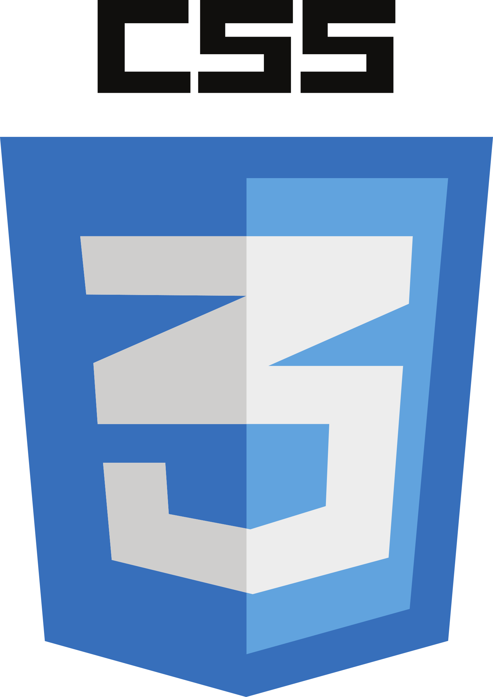
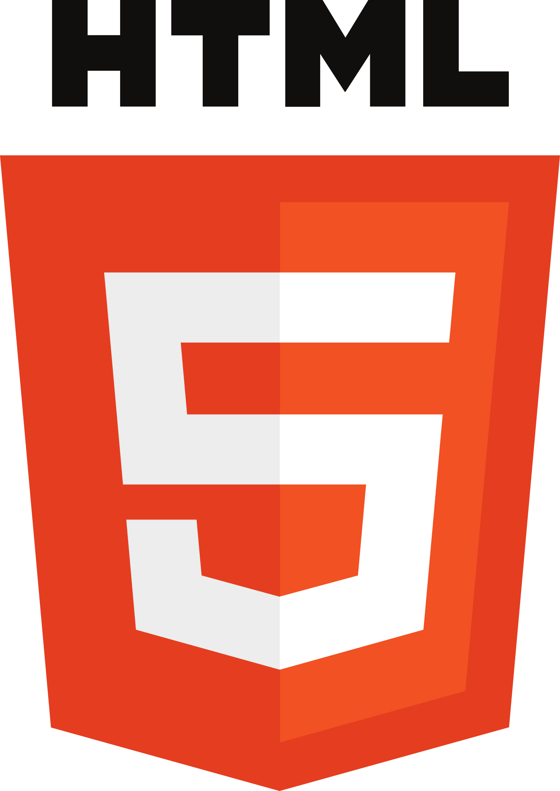
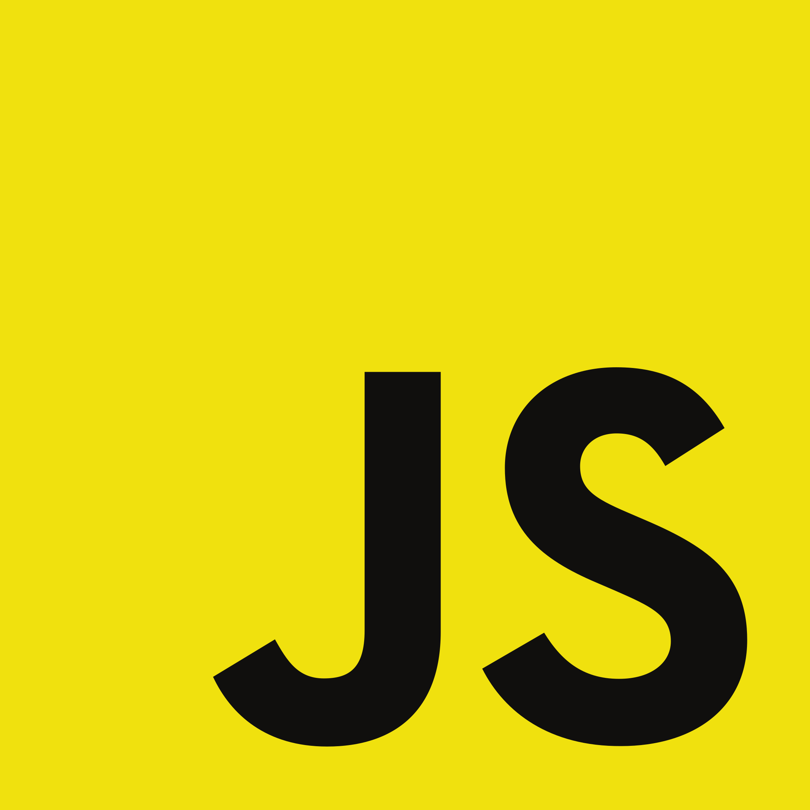
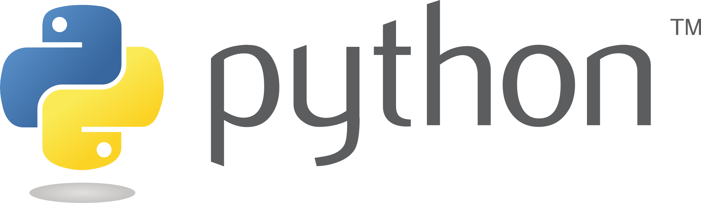

## Hi there 👋 My name is Uxío Juncal

I am an Spanish student of the University Carlos III de Madrid, currently studnig Informatic Engeneneering (at least that is how we call it here) and Business Management. I am generally interested in most of the fields of the computer science, but right now I spend most of me 'free' time learning about web developement, since I spent some months working on the maintenance of web pages. By now, in coding I am just a beginner.

Now here is the basic gitHub template for profile READMEs:

Tools:

      

- 🔭 I’m currently working on this page. 
- 🌱 I’m currently learning computer science (at University) CSS and JS
- 👯 I’m looking to collaborate on anything!
- 🤔 I’m looking for advice on my career as a computer scientist.
- 📫 How to reach me: Just do it here
